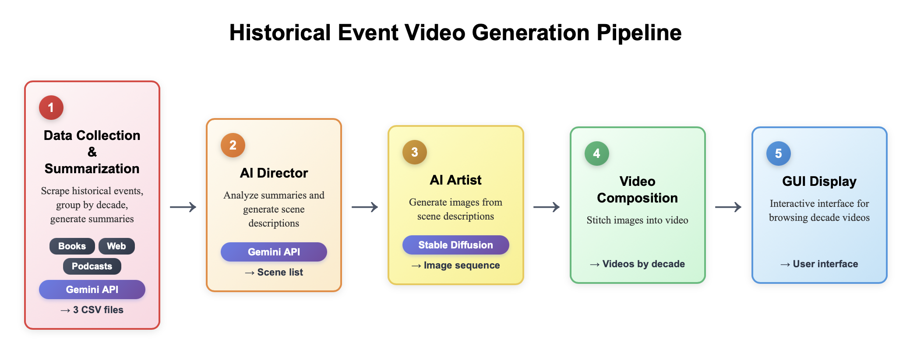

# RetroVision
An AI portal that turns books and podcasts about Troy into short narrated videos, letting students watch the city’s history unfold—on a platform that can later scale to any city.

# Architecture



# Running data extraction

We extract data from 3 different sources:
1. A carefully compiled book about the history of Troy(https://archive.org/details/cu31924028826472/page/56/mode/2up)
2. Online text sources
3. Podcasts

To run data extraction, you first need to download the book from https://archive.org/details/cu31924028826472/page/56/mode/2up into the data_extraction directory. This project requires Python version 3.13.

After this, run
```
cd data_extraction
pip install -r requirements.txt
export GEMINI_API_KEY=<insert your API key here>
python extract_events_by_decade_book.py
python extract_events_by_decade_podcast.py
python extract_events_by_decade_web.py
```

This will generate csv files with decade based historical information, which is then ingested by the video generation notebook.


